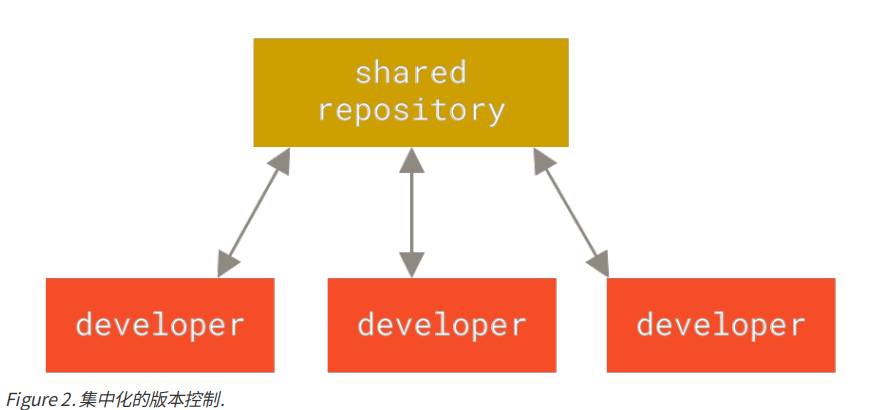
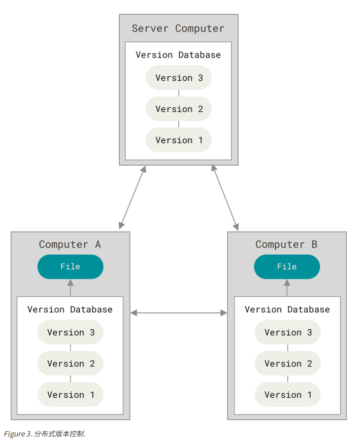
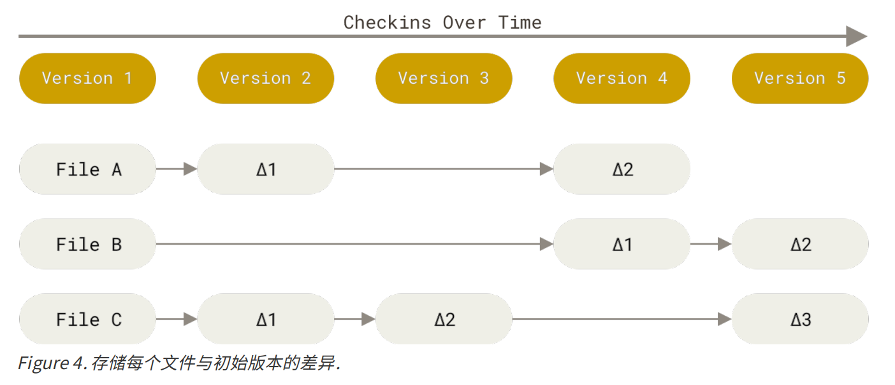
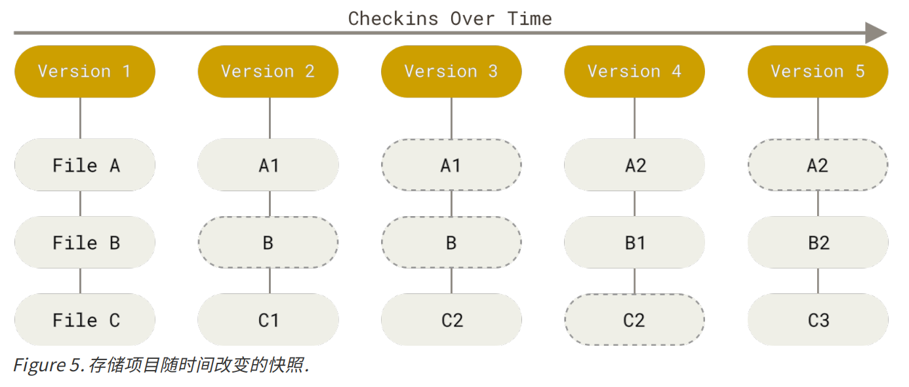
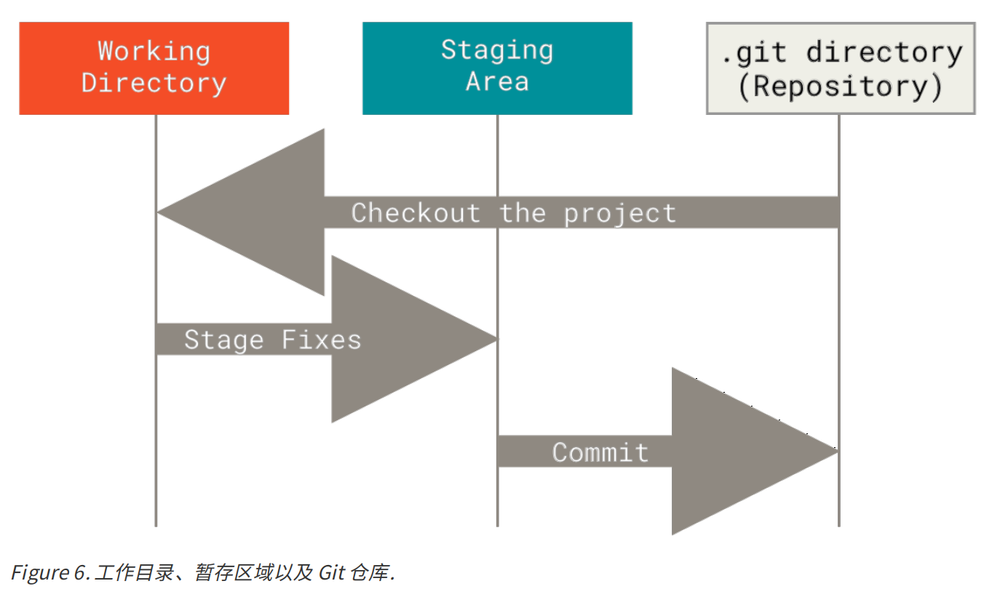

## 起步


### 一、 关于版本控制

什么是“版本控制”？我为什么要关心它呢？ 版本控制是一种记录一个或若干文件内容变化，以便将来查阅特
定版本修订情况的系统。 在本书所展示的例子中，我们对保存着软件源代码的文件作版本控制，但实际上，你
可以对任何类型的文件进行版本控制。


#### 1. 本地版本控制系统


####  2. 集中化的版本控制系统  

集中化的版本控制系统，如 CVS、Subversion 以及Perforce 等，都有一个单一的集中管理的服务器，保存所有文件的修订版本，而协同工作的人们都通过客户端连到这台服务器，取出最新的文件或者提交更新。 多年以来，这已成为版本控制系统的标准做法。  




**好处**： 每个人都可以在一定程度上看到项目中的其他人正在做些什么。 而管理员也可以轻松掌控每个开发者的权限，并且管理一个 CVCS 要远比在各个客户端上维护本地数据库来得轻松容易。  

**缺点**： 是中央服务器的单点故障。 如果宕机一小时，那么在这一小时内，谁都无法提交更新，也就无法协同工作。 如果中心数据库所在的磁盘发生损坏，又没有做恰当备份，毫无疑问你将丢失所有数据——包括项目的整个变更历史，只剩下人们在各自机器上保留的单独快照。 本地版本控制系统也存在类似问题，只要整个项目的历史记录被保存在单一位置，就有丢失所有历史更新记录的风险。  


#### 3. 分布式版本控制系统  

分布式版本控制系统 ，客户端并不只提取最新版本的文件快照， 而是把代码仓库完整地镜像下来，包括完整的历史记录。 这么一来，任何一处协同工作用的服务器发生故障，事后都可以用任何一个镜像出来的本地仓库恢复。 因为每一次的克隆操作，实际上都是一次对代码仓库的完整备份。  




### 二、 Git是什么


#### 1. 直接记录快照，而非差异比较


CVS、Subversion  将它们存储的信息看作是一组基本文件和每个文件随时间逐步累积的差异。（通常称作 **基于差异（delta-based）** 的版本控制  ）




在 Git中，每当你提交更新或保存项目状态时，它基本上就会对当时的全部文件创建一个快照并保存这个快照的索引。为了效率，如果文件没有修改，Git 不再重新存储该文件，而是只保留一个链接指向之前存储的文件。 Git 对待数据更像是一个 **快照流**。  




#### 2. 近乎所有操作都是本地执行  


#### 3. Git 保证完整性  

Git 中所有的数据在存储前都计算校验和，然后以校验和来引用。 这意味着不可能在 Git 不知情时更改任何文件内容或目录内容。  

Git 用以计算校验和的机制叫做 SHA-1 散列（hash，哈希）。 这是一个由 40 个十六进制字符（0-9 和 a-f）组成的字符串，基于 Git 中文件的内容或目录结构计算出来。   

```
24b9da6552252987aa493b52f8696cd6d3b00373
```

Git 数据库中保存的信息都是以文件内容的哈希值来索引，而不是文件名。  


#### 4. Git 一般只添加数据  


#### 5. 三种状态

Git 有三种状态，你的文件可能处于其中之一：**已修改（modified）**、**已暂存（staged）** 和 **已提交（committed）** 。

+ **已修改** 表示修改了文件，但还没保存到数据库中。

+ **已暂存** 表示对一个已修改文件的当前版本做了标记，使之包含在下次提交的快照中。

+ **已提交** 表示数据已经安全地保存在本地数据库中。  


Git 项目拥有三个阶段：**工作区、暂存区以及 Git 仓库**。  



**工作区** 是对项目的某个版本独立提取出来的内容。 这些从 Git 仓库的压缩数据库中提取出来的文件，放在磁盘上
供你使用或修改。

**暂存区** 是一个文件，保存了下次将要提交的文件列表信息，一般在 Git 仓库目录中。 按照 Git 的术语叫做“索
引”，不过一般说法还是叫“暂存区”。

**Git 仓库目录** 是 Git 用来保存项目的元数据和对象数据库的地方。 这是 Git 中最重要的部分，从其它计算机克隆
仓库时，复制的就是这里的数据。  


基本的 Git 工作流程如下：

1. 在工作区中修改文件。

2. 将你想要下次提交的更改选择性地暂存，这样只会将更改的部分添加到暂存区。

3. 提交更新，找到暂存区的文件，将快照永久性存储到 Git 目录。

   

如果 Git 目录中保存着特定版本的文件，就属于 **已提交** 状态。 如果文件已修改并放入暂存区，就属于 **已暂存** 状态。 如果自上次检出后，作了修改但还没有放到暂存区域，就是 **已修改** 状态。 


### 三、 安装Git


### 四、 Git配置

Git 自带一个 git config 的工具来帮助设置控制 Git 外观和行为的配置变量。 这些变量存储在三个不同的位置：

1. **/etc/gitconfig** 文件: 包含系统上每一个用户及他们仓库的通用配置。 如果在执行 `git config` 时带上`--system` 选项，那么它就会读写该文件中的配置变量。 （由于它是系统配置文件，因此你需要管理员或超级用户权限来修改它。）
2. **~/.gitconfig 或 ~/.config/git/config 文件**：只针对当前用户。 你可以传递 `--global` 选项让 Git 读写此文件，这会对你系统上 **所有** 的仓库生效。
3. 当前使用仓库的 Git 目录中的 **config** 文件（即 **.git/config**）：针对该仓库。 你可以传递` --local `选项让 Git 强制读写此文件，虽然默认情况下用的就是它。。 （当然，你需要进入某个 Git 仓库中才能让该选项生效。）  


每一个级别会覆盖上一级别的配置，所以  **.git/config** 优先级最高。


#### 一、 用户信息

安装完 Git 之后，要做的第一件事就是设置你的用户名和邮件地址。  每一个 Git 提交都会使用这些信息，它们会写入到你的每一次提交中，不可更改：

```shell
$ git config --global user.name "John Doe"
$ git config --global user.email johndoe@example.com
```

再次强调，如果使用了` --global `选项，那么该命令只需要运行一次，因为之后无论你在该系统上做任何事
情， Git 都会使用那些信息。 当你想针对特定项目使用不同的用户名称与邮件地址时，可以在那个项目目录下运
行没有 `--global` 选项的命令来配置。  

#### 2、 检查配置信息
如果想要检查你的配置，可以使用 `git config --list` 命令来列出所有 Git 当时能找到的配置。  

```shell
$ git config --list
user.name=John Doe
user.email=johndoe@example.com
color.status=auto
color.branch=auto
color.interactive=auto
color.diff=auto
...
```

你可以通过输入 `git config <key>`： 来检查 Git 的某一项配置  

```shell
$ git config user.name
John Doe
```

