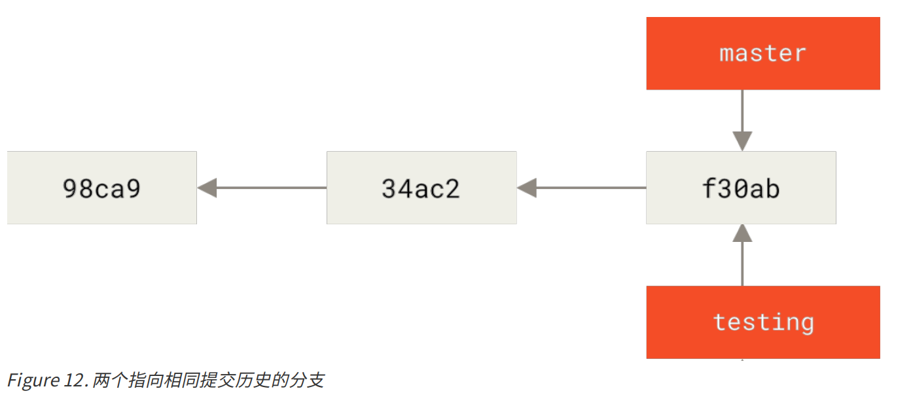

## Git 分支


#### 一、分支简介

##### 1. 创建分支

Git创建分支，只是创建了一个可以移动的新的指针。 

```shell
$ git branch testing
```

这会在当前所在的提交对象上创建一个指针。  



##### 2. 切换分支

Git使用一个名为 HEAD 的特殊指针，指向当前所在的本地分支。


要切换到一个已存在的分支，你需要使用 git checkout 命令。  

```shell
$ git checkout testing
```

这样 HEAD 就指向 testing 分支了。  


