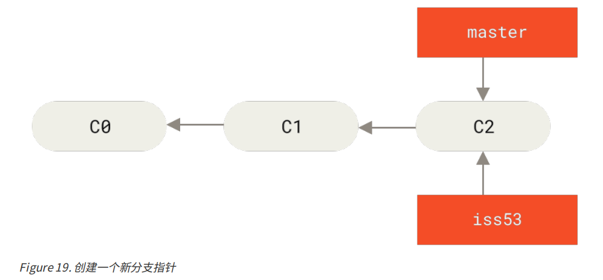
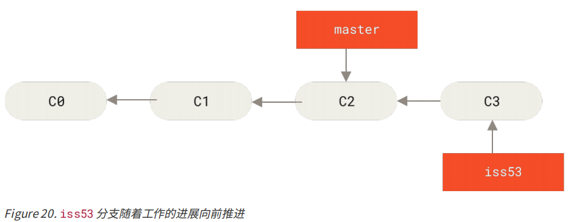
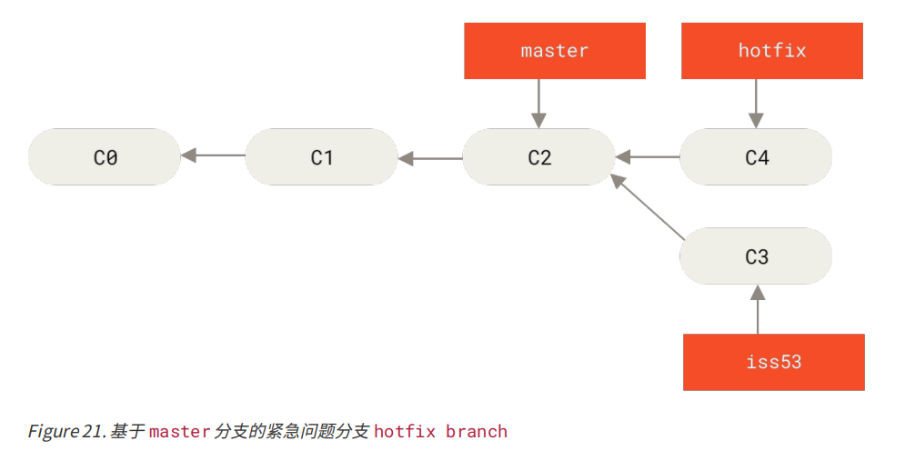
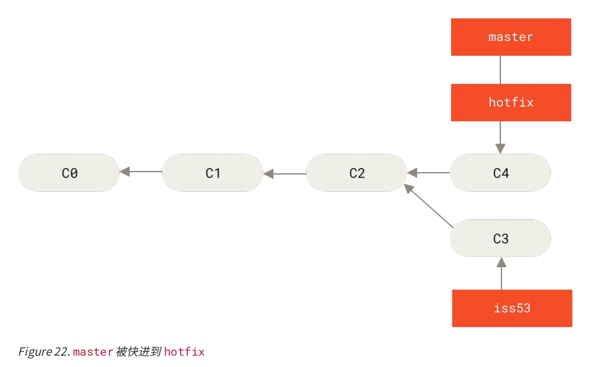
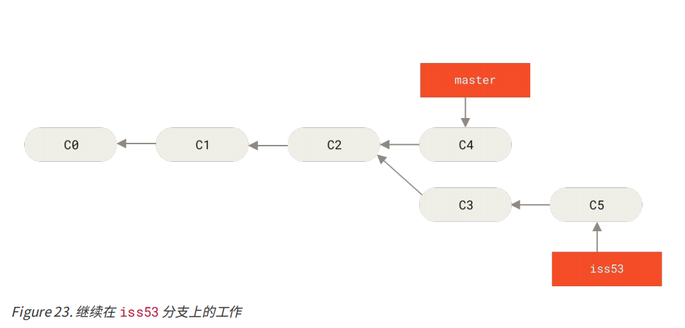
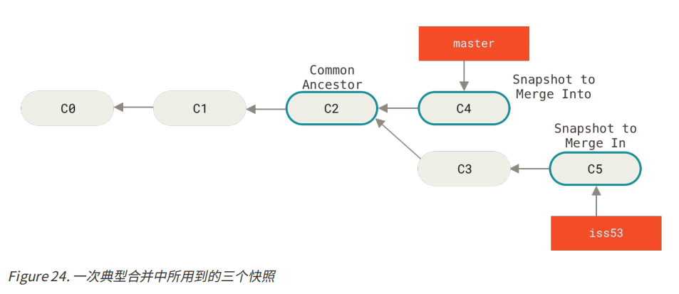
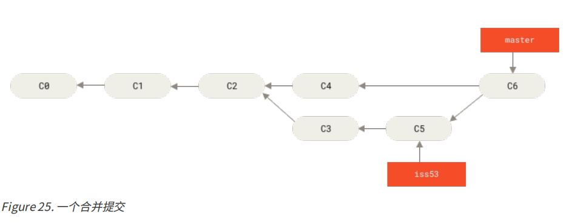

#### 二、分支的新建与合并


##### 1. 新建并切换分支

```shell
$ git checkout -b iss53
Switched to a new branch "iss53"
```

它是下面两条命令的简写：

```shell
$ git branch iss53
$ git checkout iss53
```





##### 2. 提交分支




> 注意：此时一定要留意你的工作目录和暂存区里那些还没有被提交的修改， 它可能会和你即将检出的分支产生冲突从而阻止 Git 切换到该分支。 最好的方法是，在你切换分支之前，保持好一个干净的状态。 有一些方法可以绕过这个问题（即，暂存（stashing） 和 修补提交（commit amending））


##### 3. 切换回主线，并新建分支hotfix，向前推进

```shell
# 切换回主线
$ git checkout master

# 新建并切换到hotfix
$ git checkout -b hotfix
Switched to a new branch 'hotfix'
# 提交hotfix分支
$ git commit -a -m ""
```




##### 4. 将 hotfix 分支合并回你的 master 分支

```shell
$ git checkout master
$ git merge hotfix
Updating f42c576..3a0874c
Fast-forward
 index.html | 2 ++
 1 file changed, 2 insertions(+)
```

在合并的时候，你应该注意到了“快进（fast-forward）”这个词。 由于你想要合并的分支 hotfix 所指向的提交 C4 是你所在的提交 C2 的直接后继， 因此 Git 会直接将指针向前移动。换句话说，当你试图合并两个分支时， 如果顺着一个分支走下去能够到达另一个分支，那么 Git 在合并两者的时候， 只会简单的将指针向前推进 （指针右移），因为这种情况下的合并操作没有需要解决的分歧——这就叫做 “**快进（fast-forward）**”。




##### 5. 删除 hotfix 分支

```shell
$ git branch -d hotfix
Deleted branch hotfix (3a0874c).
```


##### 6. 切换回未完成工作的分支，继续工作

```shell
$ git checkout iss53
Switched to branch "iss53"
$ vim index.html
$ git commit -a -m 'finished the new footer [issue 53]'
[iss53 ad82d7a] finished the new footer [issue 53]
1 file changed, 1 insertion(+)
```



> 你在 hotfix 分支上所做的工作并没有包含到 iss53 分支中。 如果你需要拉取 hotfix 所做的修改，你可以使用 git merge master 命令将 master 分支合并入 iss53 分支，或者你也可以等到 iss53 分支完成其使命，再将其合并回 master 分支。


##### 7. 将分支合并到主线

```shell
$ git checkout master
Switched to branch 'master'
$ git merge iss53
Merge made by the 'recursive' strategy.
index.html | 1 +
1 file changed, 1 insertion(+)
```

> 这和你之前合并 hotfix 分支的时候看起来有一点不一样。 在这种情况下，你的开发历史从一个更早的地方开始分叉开来（diverged）。 因为，master 分支所在提交并不是 iss53 分支所在提交的直接祖先，Git 不得不76做一些额外的工作。 出现这种情况的时候，Git 会使用两个分支的末端所指的快照（C4 和 C5）以及这两个分支的公共祖先（C2），做一个简单的三方合并。



> 和之前将分支指针向前推进所不同的是，Git 将此次三方合并的结果做了一个新的快照并且自动创建一个新的提交指向它。 这个被称作一次合并提交，它的特别之处在于他有不止一个父提交。




##### 8. 遇到冲突时的分支合并

```shell
<<<<<<< HEAD:index.html
<div id="footer">contact : email.support@github.com</div>
=======
<div id="footer">
 please contact us at support@github.com
</div>
>>>>>>> iss53:index.html
```

> 这表示 HEAD 所指示的版本（也就是你的 master 分支所在的位置，因为你在运行 merge 命令的时候已经检出到了这个分支）在这个区段的上半部分（======= 的上半部分），而 iss53 分支所指示的版本在 ======= 的 下半部分。 为了解决冲突，你必须选择使用由 ======= 分割的两部分中的一个，或者你也可以自行合并这些内容。 


##### 9. 删除分支

```shell
$ git branch -d iss53
```
