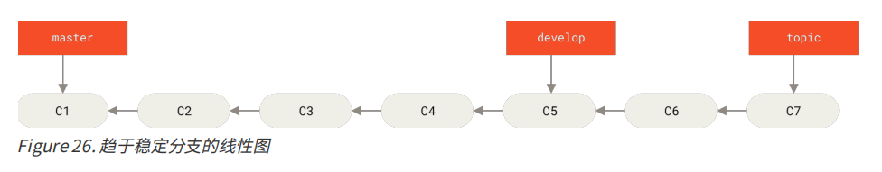
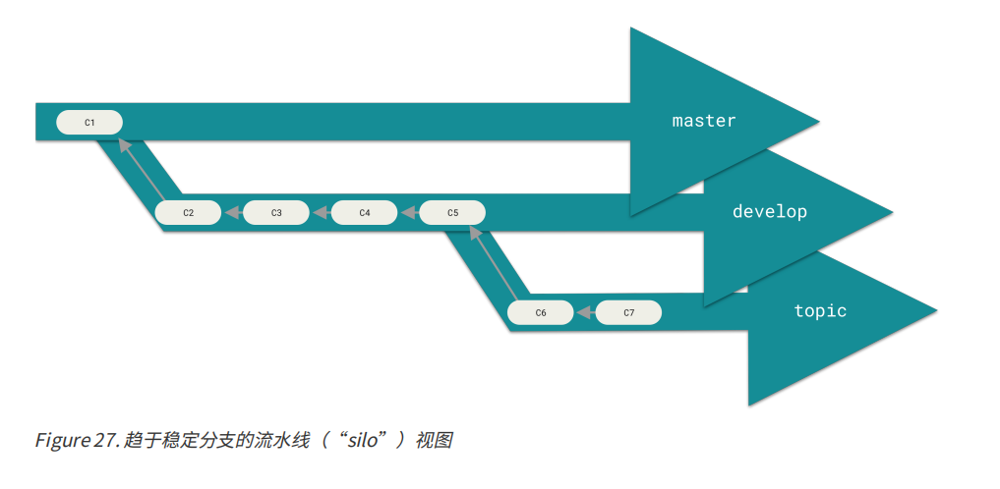
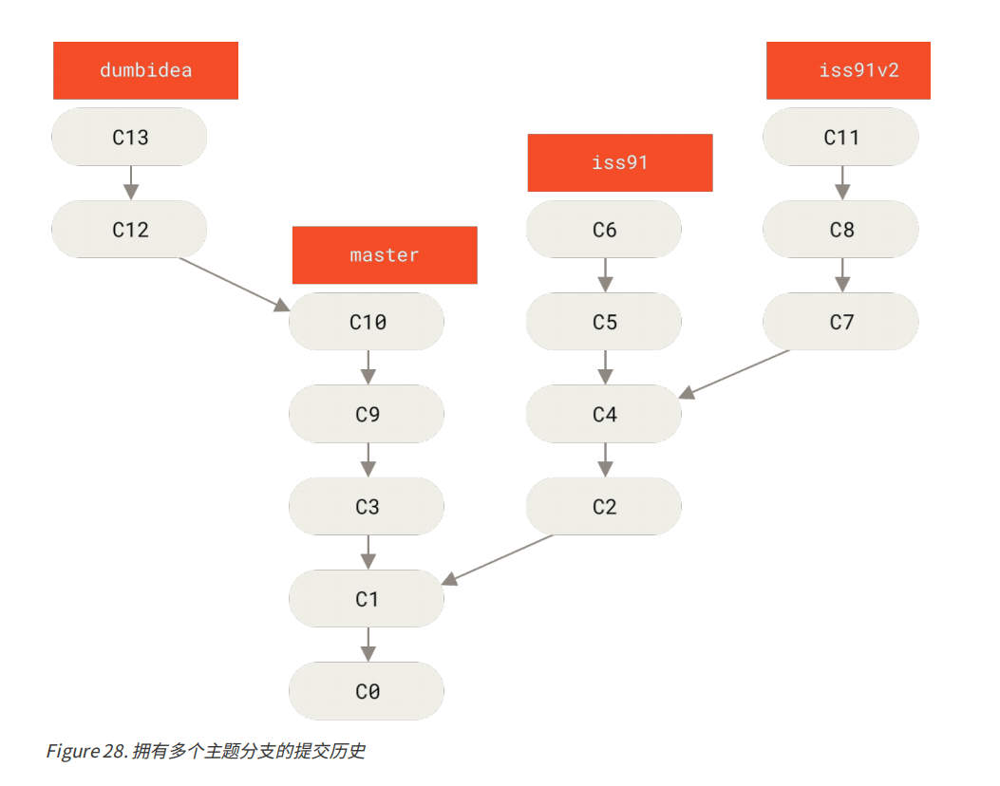
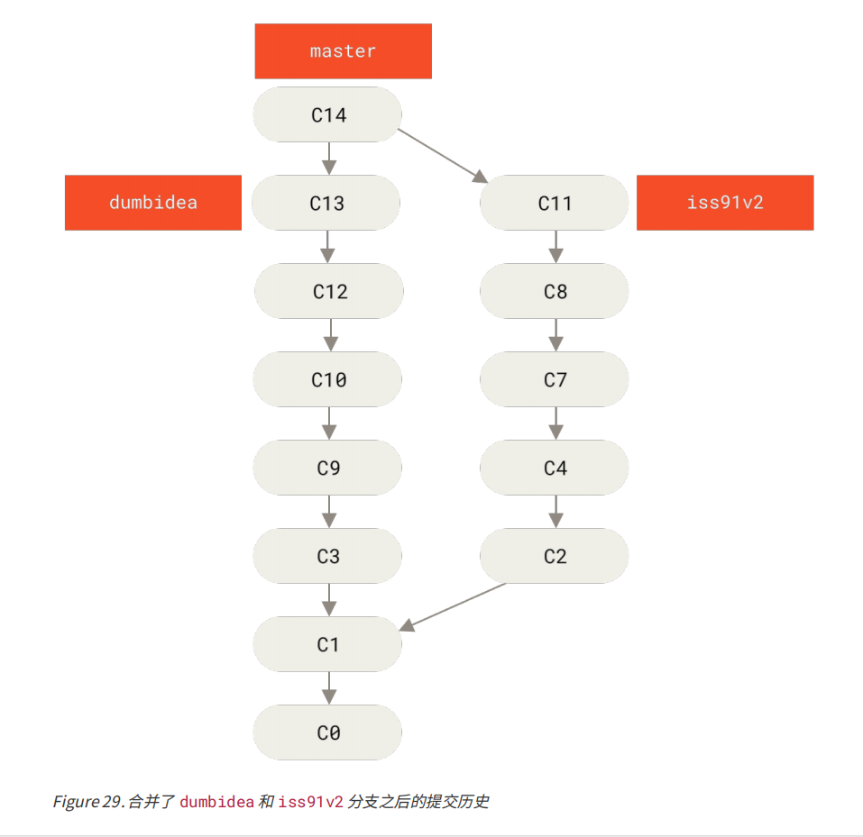

#### 四、分支开发工作流

##### 1. 长期分支

+ 只在 master 分支上保留完全稳定的代码
+ develop 被用来做后续开发或者测试稳定性
+ develop 不必保持绝对稳定，但是一旦达到稳定状态，就被合并入 master 分支
+ 

##### 2. 主题分支

在分支的新建与合并模块就是使用的主题分支。

决定使用在 iss91v2 分支和 dumbidea 分支中的方案，并抛弃 iss91 分支（即丢弃C5 和 C6 提交），然后把另外两个分支合并入主干分支。 最终你的提交历史看起来像下面这个样子：

当你做这么多操作的时候，这些分支全部都存于本地。 当你新建和合并分支的时候，所有这一切都只发生在你本地的 Git 版本库中 —— 没有与服务器发生交互。

