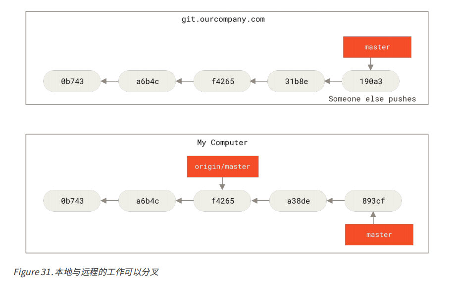

#### 五、 远程分支

远程引用是对远程仓库的引用（指针），包括分支、标签等等。


>  **远程仓库 origin** 与分支名字 “master” 一样，在 Git 中并没有任何特别的含义。 同时 “master” 是当你运行 git init 时默认的起始分支名字，原因仅仅是它的广泛使用， “origin” 是当你运行 git clone 时默认的远程仓库名字。 


##### 1. clone


如果你在本地的 master 分支做了一些工作，在同一段时间内有其他人推送提交到 git.ourcompany.com并且更新了它的 master 分支，这就是说你们的提交历史已走向不同的方向。 即便这样，只要你保持不与origin 服务器连接（并拉取数据），你的 origin/master 指针就不会移动。





##### 2. fetch

```shell
$ git fetch origin
```


##### 3. push

如果希望和别人一起在名为 serverfix 的分支上工作，你可以像推送第一个分支那样推送它。

```shell
# git push origin serverfix:serverfix 下面的是简化版，意思是推送本地的 serverfix 分支，将其作为远程仓库的 serverfix 分支
$ git push origin serverfix
Counting objects: 24, done.
Delta compression using up to 8 threads.
Compressing objects: 100% (15/15), done.
Writing objects: 100% (24/24), 1.91 KiB | 0 bytes/s, done.
Total 24 (delta 2), reused 0 (delta 0)
To https://github.com/schacon/simplegit
 * [new branch] serverfix -> serverfix
```


其他人如果想要在自己的serverfix 分支上工作，可以将其建立在远程跟踪分支之上

```shell
$ git checkout -b serverfix origin/serverfix
Branch serverfix set up to track remote branch serverfix from origin.
Switched to a new branch 'serverfix'
```


##### 4. 跟踪分支

从一个远程跟踪分支检出一个本地分支会自动创建所谓的“跟踪分支”（它跟踪的分支叫做“上游分支”）。跟踪分支是与远程分支有直接关系的本地分支。 如果在一个跟踪分支上输入 git pull，Git 能自动地识别去哪个服务器上抓取、合并到哪个分支。


当克隆一个仓库时，它通常会自动地创建一个跟踪 origin/master 的 master 分支。 


```shell
$ git checkout -b <branch> <remote>/<branch>
```

上面命令的快捷操作命令 --track 

```shell
$ git checkout --track origin/serverfix
Branch serverfix set up to track remote branch serverfix from origin.
Switched to a new branch 'serverfix'
```

如果你尝试检出的分支 (a) 不存在且 (b) 刚好只有一个名字与之匹配的远程分支，那么 Git 就会为你创建一个跟踪分支：

```shell
$ git checkout serverfix
Branch serverfix set up to track remote branch serverfix from origin.
Switched to a new branch 'serverfix'
```

##### 5. 拉取

+ git fetch 命令从服务器上抓取后，并不会修改工作目录中的内容
+ git pull = git fetch + git merge
+ git pull 会查找当前分支所跟踪的服务器与分支， 从服务器上抓取数据然后尝试合并入那个远程分支


> 由于 git pull 的魔法经常令人困惑所以通常单独显式地使用 fetch 与 merge 命令会更好一些。


##### 6. 删除远程分支

```shell
$ git push origin --delete serverfix
To https://github.com/schacon/simplegit
 - [deleted] serverfix
```

