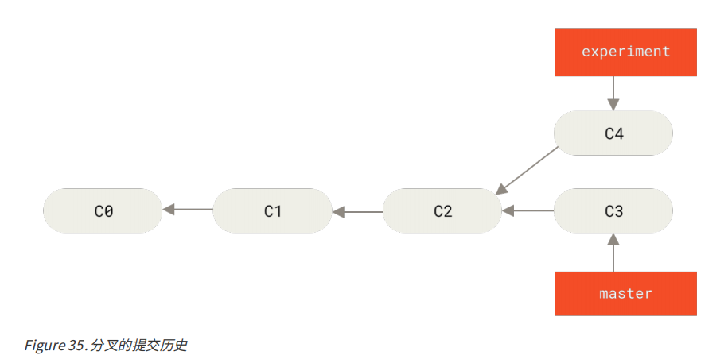
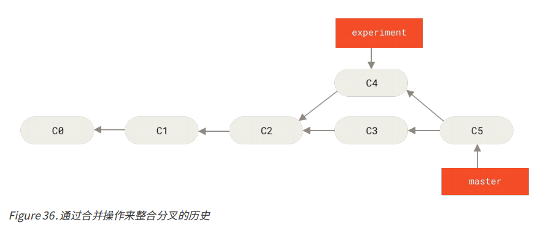
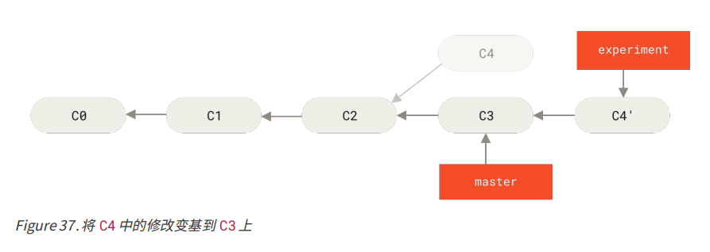
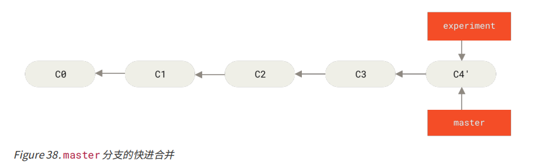
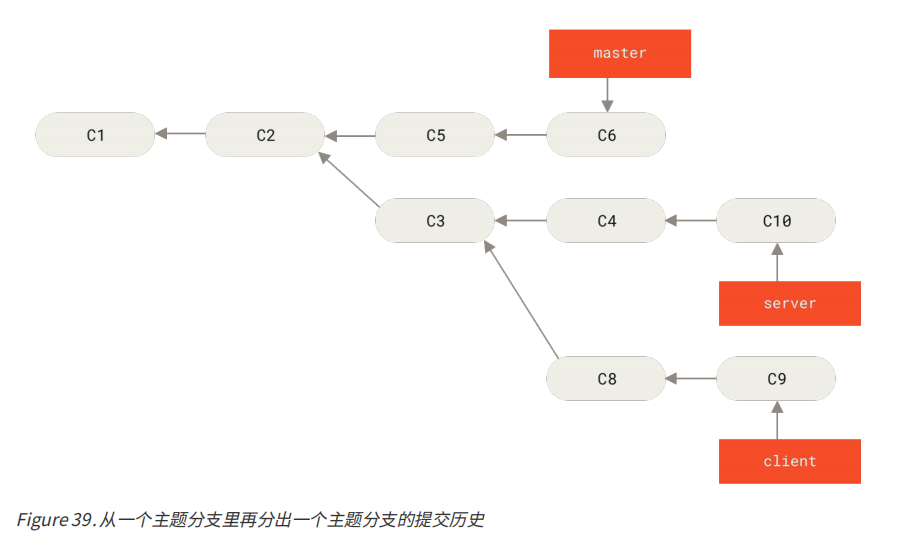
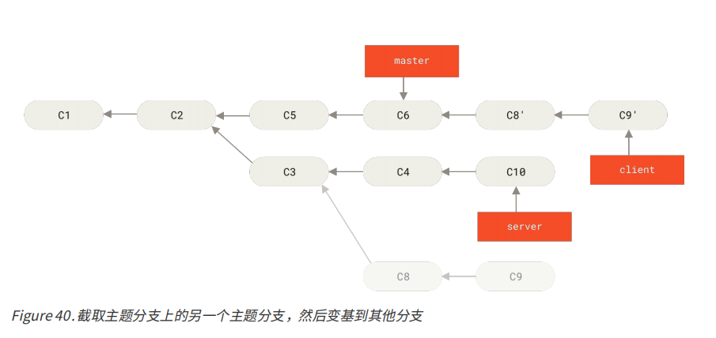
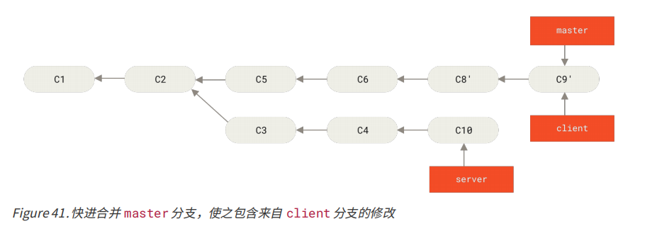
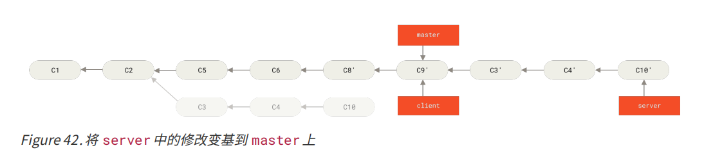
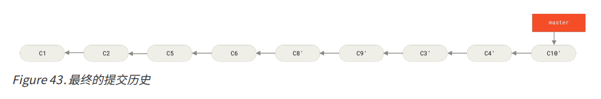

#### 六、 变基

在 Git 中整合来自不同分支的修改主要有两种方法：merge 以及 rebase。


merge是把两个分支的最新快照（C3 和 C4）以及二者最近的共同祖先（C2）进行三方合并，合并的结果是生成一个新的快照（并提交）。







rebase可以提取在 C4 中引入的补丁和修改，然后在 C3 的基础上应用一次。 

```shell
$ git checkout experiment
$ git rebase master
First, rewinding head to replay your work on top of it...
Applying: added staged command
```




回到 master 分支，进行一次快进合并。

```shell
$ git checkout master
$ git merge experiment
```




一般我们这样做的目的是为了确保在向远程分支推送时能保持提交历史的整洁。

> 无论是通过变基，还是通过三方合并，整合的最终结果所指向的快照始终是一样的，只不过提交历史不同罢了。 变基是将一系列提交按照原有次序依次应用到另一分支上，而合并是把最终结果合在一起。


稍复杂的变基例子





希望将 client 中的修改合并到主分支并发布，但暂时并不想合并 server 中的修改


```shell
$ git rebase --onto master server client
```



```shell
$ git checkout master
$ git merge client
```



```shell
$ git rebase master server
```



```shell
$ git checkout master
$ git merge server
$ git branch -d client
$ git branch -d server
```




**如果提交存在于你的仓库之外，而别人可能基于这些提交进行开发，那么不要执行变基。** 

