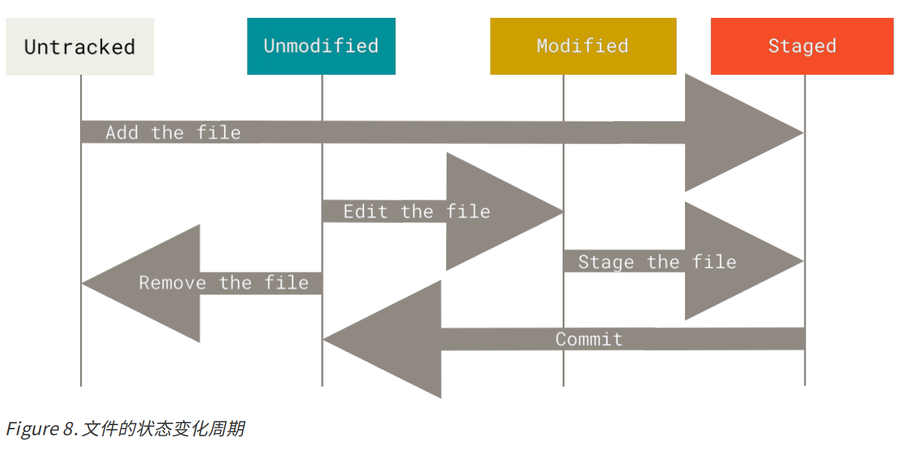

### 二、 记录每次更新到仓库


工作目录下的每一个文件都不外乎这两种状态：**已跟踪** 或 **未跟踪**。  

**已跟踪**的文件是指那些被纳入了版本控制的文件，在上一次快照中有它们的记录，在工作一段时间后， 它们的状态可能是未修改，已修改或已放入暂存区。  

工作目录中除已跟踪文件外的其它所有文件都属于未跟踪文件，它们既不存在于上次快照的记录中，也没有被放入暂存区。  





#### 1. 检查当前文件状态

用 `git status` 命令查看哪些文件处于什么状态  

```shell
# 新增一个README文件后查看文件状态
$ git status
On branch master
Your branch is up-to-date with 'origin/master'.
Untracked files:
(use "git add <file>..." to include in what will be committed) README
nothing added to commit but untracked files present (use "git add" to track)
```


#### 2. 跟踪新文件

使用命令 git add 开始跟踪一个文件  

```shell
# 将README文件添加跟踪
$ git add README
$ git status
On branch master
Your branch is up-to-date with 'origin/master'.
Changes to be committed:
(use "git restore --staged <file>..." to unstage)
new file: README
```

只要在 `Changes to be committed` 这行下面的，就说明是已暂存状态。


#### 3. 暂存已修改的文件

修改已被跟踪的文件 CONTRIBUTING.md 

```shell
$ git status
On branch master
Your branch is up-to-date with 'origin/master'.
Changes to be committed:
(use "git reset HEAD <file>..." to unstage)
new file: README
Changes not staged for commit:
(use "git add <file>..." to update what will be committed)
(use "git checkout -- <file>..." to discard changes in working
directory)
modified: CONTRIBUTING.md
```

文件 CONTRIBUTING.md 出现在 `Changes not staged for commit` 这行下面，说明已跟踪文件的内容发生了变化，但还没有放到暂存区。 要暂存这次更新，需要运行 `git add` 命令。  


**git add**  

+ 开始跟踪新文件
+ 把已跟踪的文件放到暂存区
+ 合并时把有冲突的文件标记为已解决状态等  

> 将这个命令理解为“精确地将内容添加到下一次提交中”而不是“将一个文件添加到项目中”要更加合适。   

运行 `git add` 将“CONTRIBUTING.md”放到暂存区，然后再看看 `git status` 的输出  

```shell
$ git add CONTRIBUTING.md
$ git status
On branch master
Your branch is up-to-date with 'origin/master'.
Changes to be committed:
(use "git reset HEAD <file>..." to unstage)
new file: README
modified: CONTRIBUTING.md
```


假设此时，你想要在 CONTRIBUTING.md 里再加条注释。 重新编辑存盘后，准备好提交。 运行 `git status`

```shell
$ git status
On branch master
Your branch is up-to-date with 'origin/master'.
Changes to be committed:
(use "git reset HEAD <file>..." to unstage)
new file: README
modified: CONTRIBUTING.md
Changes not staged for commit:
(use "git add <file>..." to update what will be committed)
(use "git checkout -- <file>..." to discard changes in working
directory)
modified: CONTRIBUTING.md
```

Git 只不过暂存了你运行 git add 命令时的版本。 如果你现在提交，CONTRIBUTING.md 的版本是你最后一次运行`git add` 命令时的那个版本，而不是你运行 `git commit` 时，在工作目录中的当前版本。 所以，运行了 git add 之后又作了修订的文件，需要重新运行 `git add` 把最新版本重新暂存起来  


#### 4. 状态简览  

使用 `git status -s` 命令或 `git status --short` 命令，以简化`git status`输出  

```shell
$ git status -s
M README
MM Rakefile
A lib/git.rb
M lib/simplegit.rb
?? LICENSE.txt
```

左栏指明了暂存区的状态，右栏指明了工作区的状态  

+ 新添加的未跟踪文件前面有 ?? 标记，

+ 新添加到暂存区中的文件前面有 A 标记，
+ 修改过的文件前面有 M 标记。 


#### 5. 忽略文件  

创建一个名为 `.gitignore` 的文件，列出要忽略的文件的模式  

养成一开始就为你的新仓库设置好 .gitignore 文件的习惯，以免将来误提交这类无用的文件。

文件 `.gitignore` 的格式规范如下：
+ 所有空行或者以 # 开头的行都会被 Git 忽略。
+ 可以使用标准的 glob 模式匹配，它会递归地应用在整个工作区中。
+ 匹配模式可以以（/）开头防止递归。
+ 匹配模式可以以（/）结尾指定目录。
+ 要忽略指定模式以外的文件或目录，可以在模式前加上叹号（!）取反。  

glob 模式是指 shell 所使用的简化了的正则表达式。  

+ 星号（*）匹配零个或多个任意字符；
+ [abc] 匹配任何一个列在方括号中的字符 （这个例子要么匹配一个 a，要么匹配一个 b，要么匹配一个 c）；
+ 问号（?）只匹配一个任意字符；
+ 如果在方括号中使用短划线分隔两个字符， 表示所有在这两个字符范围内的都可以匹配（比如 [0-9] 表示匹配所有 0 到 9 的数字）。 
+ 使用两个星号（\*\*）表示匹配任意中间目录，比如 a/\*\*/z 可以匹配 a/z 、 a/b/z 或 a/b/c/z 等  

```shell
# 忽略所有的 .a 文件
*.a
# 但跟踪所有的 lib.a，即便你在前面忽略了 .a 文件
!lib.a
# 只忽略当前目录下的 TODO 文件，而不忽略 subdir/TODO
/TODO
# 忽略任何目录下名为 build 的文件夹
build/
# 忽略 doc/notes.txt，但不忽略 doc/server/arch.txt
doc/*.txt
# 忽略 doc/ 目录及其所有子目录下的 .pdf 文件
doc/**/*.pdf
```


`.gitignore`示例(Java):

```shell
# Compiled class file
*.class

# Log file
*.log

# BlueJ files
*.ctxt

# Mobile Tools for Java (J2ME)
.mtj.tmp/

# Package Files #
*.jar
*.war
*.nar
*.ear
*.zip
*.tar.gz
*.rar

# virtual machine crash logs, see http://www.java.com/en/download/help/error_hotspot.xml
hs_err_pid*
```


#### 6. 查看已暂存和未暂存的修改  

不如用工具方便。


#### 7. 提交更新

```shell
# 打开文本编辑器，输入本次提交的注释
git commit
# 直接输入注释，不打开文本编辑器
git commit -m "注释"
```

在提交的时候，给 `git commit` 加上 **-a** 选项，Git 就会自动把所有已经跟踪过的文件暂存起来一并提交，从而跳过 `git add` 步骤。


#### 8. 移除文件

用 `git rm` 命令完成此项工作，并连带从工作目录中删除指定的文件，这样以后就不会出现在未跟踪文件清单中了。  

只是简单的手工删除文件后，运行`git status`，提示再运行 `git rm` 记录此次移除文件的操作  

```shell
$ git status
On branch master
Your branch is up-to-date with 'origin/master'.
Changes not staged for commit:
(use "git add/rm <file>..." to update what will be committed)
(use "git checkout -- <file>..." to discard changes in working
directory)
deleted: PROJECTS.md
no changes added to commit (use "git add" and/or "git commit -a")
```


如果要删除之前修改过或已经放到暂存区的文件，则必须使用强制删除选项 `-f`（译注：即 force 的首字母）。 这是一种安全特性，用于防止误删尚未添加到快照的数据，这样的数据不能被 Git 恢复。


当你忘记添加 .gitignore 文件，不小心把一个很大的日志文件或一堆 .a 这样的编译生成文件添加到暂存区时，使用 `git rm --cached README` 命令，将README从 Git 仓库中删除，但文件仍保留在当前工作目录中。


#### 9. 移动文件

```shell
$ git mv file_from file_to
```

运行上面的命令就相当于运行了下面三条命令：  

```shell
$ mv README.md README
$ git rm README.md
$ git add README
```
