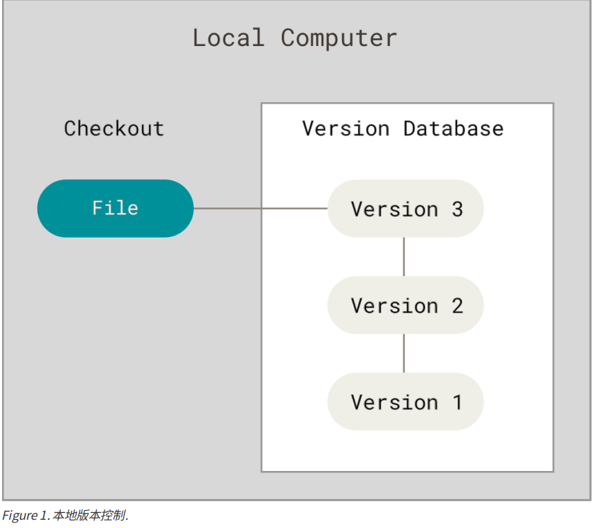

## 起步

---

### 一、 关于版本控制

什么是“版本控制”？我为什么要关心它呢？ 版本控制是一种记录一个或若干文件内容变化，以便将来查阅特
定版本修订情况的系统。 在本书所展示的例子中，我们对保存着软件源代码的文件作版本控制，但实际上，你
可以对任何类型的文件进行版本控制。

#### 1. 本地版本控制系统

####  2. 集中化的版本控制系统  

集中化的版本控制系统，如 CVS、Subversion 以及Perforce 等，都有一个单一的集中管理的服务器，保存所有文件的修订版本，而协同工作的人们都通过客户端连到这台服务器，取出最新的文件或者提交更新。 多年以来，这已成为版本控制系统的标准做法。  

**好处**： 每个人都可以在一定程度上看到项目中的其他人正在做些什么。 而管理员也可以轻松掌控每个开发者的权限，并且管理一个 CVCS 要远比在各个客户端上维护本地数据库来得轻松容易。  

**缺点**： 是中央服务器的单点故障。 如果宕机一小时，那么在这一小时内，谁都无法提交更新，也就无法协同工作。 如果中心数据库所在的磁盘发生损坏，又没有做恰当备份，毫无疑问你将丢失所有数据——包括项目的整个变更历史，只剩下人们在各自机器上保留的单独快照。 本地版本控制系统也存在类似问题，只要整个项目的历史记录被保存在单一位置，就有丢失所有历史更新记录的风险。  

#### 3. 分布式版本控制系统  

分布式版本控制系统 ，客户端并不只提取最新版本的文件快照， 而是把代码仓库完整地镜像下来，包括完整的历史记录。 这么一来，任何一处协同工作用的服务器发生故障，事后都可以用任何一个镜像出来的本地仓库恢复。 因为每一次的克隆操作，实际上都是一次对代码仓库的完整备份。  

