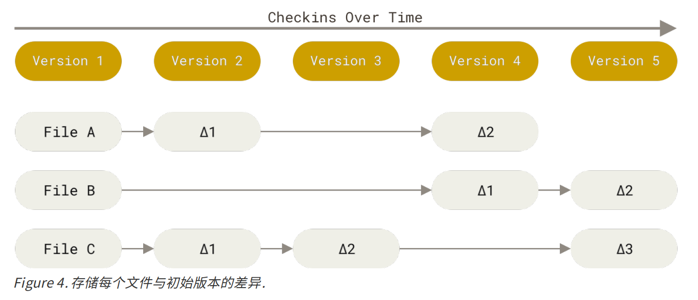
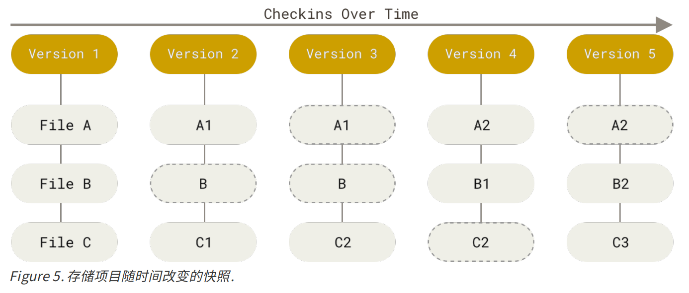

### 二、 Git是什么


#### 1. 直接记录快照，而非差异比较


CVS、Subversion  将它们存储的信息看作是一组基本文件和每个文件随时间逐步累积的差异。（通常称作 **基于差异（delta-based）** 的版本控制  ）




在 Git中，每当你提交更新或保存项目状态时，它基本上就会对当时的全部文件创建一个快照并保存这个快照的索引。为了效率，如果文件没有修改，Git 不再重新存储该文件，而是只保留一个链接指向之前存储的文件。 Git 对待数据更像是一个 **快照流**。  




#### 2. 近乎所有操作都是本地执行  


#### 3. Git 保证完整性  

Git 中所有的数据在存储前都计算校验和，然后以校验和来引用。 这意味着不可能在 Git 不知情时更改任何文件内容或目录内容。  

Git 用以计算校验和的机制叫做 SHA-1 散列（hash，哈希）。 这是一个由 40 个十六进制字符（0-9 和 a-f）组成的字符串，基于 Git 中文件的内容或目录结构计算出来。   

```
24b9da6552252987aa493b52f8696cd6d3b00373
```

Git 数据库中保存的信息都是以文件内容的哈希值来索引，而不是文件名。  


#### 4. Git 一般只添加数据  


#### 5. 三种状态

Git 有三种状态，你的文件可能处于其中之一：**已修改（modified）**、**已暂存（staged）** 和 **已提交（committed）** 。

+ **已修改** 表示修改了文件，但还没保存到数据库中。

+ **已暂存** 表示对一个已修改文件的当前版本做了标记，使之包含在下次提交的快照中。

+ **已提交** 表示数据已经安全地保存在本地数据库中。  


Git 项目拥有三个阶段：**工作区、暂存区以及 Git 仓库**。  


**工作区** 是对项目的某个版本独立提取出来的内容。 这些从 Git 仓库的压缩数据库中提取出来的文件，放在磁盘上
供你使用或修改。

**暂存区** 是一个文件，保存了下次将要提交的文件列表信息，一般在 Git 仓库目录中。 按照 Git 的术语叫做“索
引”，不过一般说法还是叫“暂存区”。

**Git 仓库目录** 是 Git 用来保存项目的元数据和对象数据库的地方。 这是 Git 中最重要的部分，从其它计算机克隆
仓库时，复制的就是这里的数据。  


基本的 Git 工作流程如下：

1. 在工作区中修改文件。

2. 将你想要下次提交的更改选择性地暂存，这样只会将更改的部分添加到暂存区。

3. 提交更新，找到暂存区的文件，将快照永久性存储到 Git 目录。

   

如果 Git 目录中保存着特定版本的文件，就属于 **已提交** 状态。 如果文件已修改并放入暂存区，就属于 **已暂存** 状态。 如果自上次检出后，作了修改但还没有放到暂存区域，就是 **已修改** 状态。 

